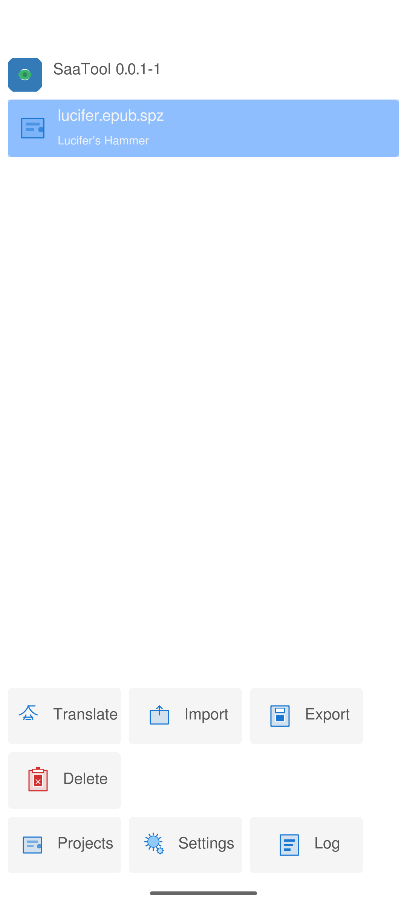
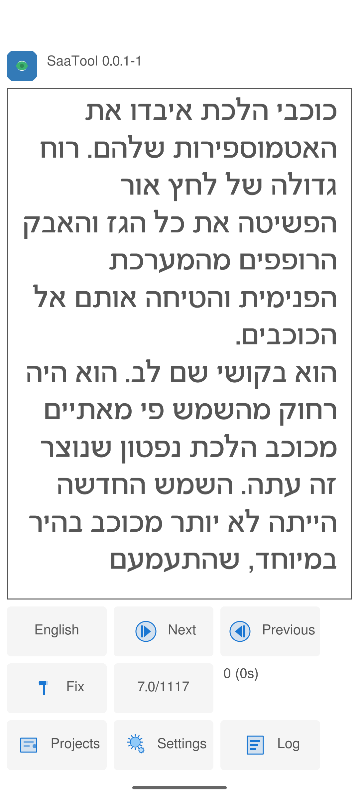
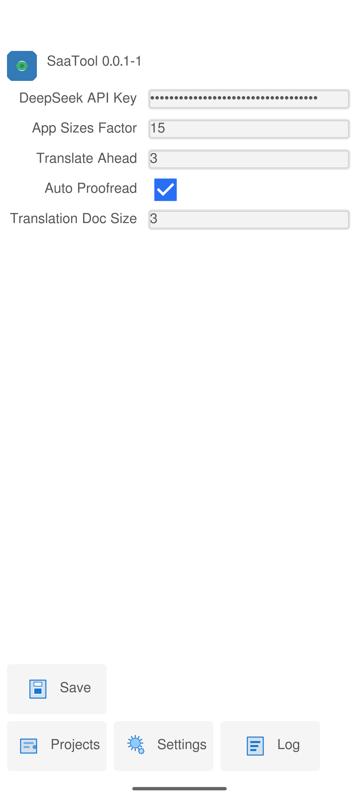

# SAATool - Software Automated Translation Tool

SAATool is an Android application designed for automated translation of EPUB books using AI technology. It provides a unique reading and translation experience by translating books paragraph by paragraph as you read, with specialized features for translation workflow management.

## Features

- **Real-time Translation**: Translates EPUB books using DeepSeek AI API as you read
- **Paragraph-by-Paragraph Translation**: Smart translation that maintains context and consistency
- **Translation Management**: Fix translations, proofread automatically, and manage translation quality
- **Offline Reading**: Continue reading translated content without internet connection
- **Export Functionality**: Export translated books back to EPUB format
- **Bidirectional Text Support**: Supports both left-to-right and right-to-left languages
- **Character Context**: AI understands character names and maintains consistency throughout translation
- **Custom UI**: Specialized interface designed for translation workflows

## How It Works

### Workflow Overview

1. **Convert to SPZ**: Use `saatooltool` to convert EPUB or PDF files into SAATool Project (`.spz`) files
2. **Import Project**: Load the `.spz` file into the Android app
3. **Configure Translation**: Set up source and target languages, add DeepSeek API key
4. **Read & Translate**: The app automatically translates paragraphs as you read them
5. **Export**: Export the completed translation as a `.spz` file from the Android app

### Translation Features

- **Smart Context**: AI maintains character names, terminology, and style consistency
- **Fix Translation**: Manually request re-translation of specific paragraphs
- **Auto Proofread**: Automatically proofread translations for better quality
- **Translate Ahead**: Pre-translate upcoming paragraphs for smoother reading experience
- **Progress Tracking**: Visual progress indicators and reading position management

## User Guide

### Prerequisites

- Android device (ARM64 or AMD64 architecture)
- DeepSeek AI API key ([Get one here](https://platform.deepseek.com))
- EPUB books to translate

### Installation

1. Download the latest APK from the releases page
2. Install on your Android device
3. Configure the DeepSeek API key in Settings

### Using SAATool

#### Step 1: Prepare Your Book

Use the `saatooltool` command-line utility to convert your EPUB or PDF:

**For EPUB files:**
```bash
./saatooltool import epub -i "your_book.epub" -f "english" -o "hebrew" --details --deepseek-api-key "your_key"
```

**For PDF files:**
```bash
./saatooltool import pdf -i "document.pdf" -f "english" -o "hebrew" -a "Author Name" -t "Document Title" --deepseek-api-key "your_key"
```

**Available options:**
- `--max-words` / `-m`: Maximum words per paragraph before considering a split (default: 200)
- `--max-words-tolerance` / `-t`: Maximum words per paragraph before forcing a split (default: 300)
- `--strip-to-ascii` / `-s`: Strip non-ASCII characters from text
- `--details` / `-d`: Use AI to get detailed book information (default: true)
- `--ocr` / `-c`: Force OCR for PDF files even if text is detected
- `--ocr-langs` / `-l`: Languages for OCR (e.g. "eng,pol")

This creates a `.spz` file ready for import.

#### Step 2: Import Project

1. Copy the `.spz` file to your Android device
2. Open SAATool
3. Tap "Import" and select your `.spz` file
4. The project will appear in your projects list

#### Step 3: Configure Settings

1. Go to Settings (gear icon)
2. Enter your DeepSeek API key
3. Adjust translation preferences:
   - **Translate Ahead**: Number of paragraphs to pre-translate (default: 6)
   - **Auto Proofread**: Automatically improve translations (recommended: ON)
   - **App Size Factor**: UI scaling factor
   - **Translation Doc Size**: Context size for AI (default: 3)

#### Step 4: Start Reading and Translating

1. Select your project and tap "Translate"
2. The app will display the book content
3. Tap to navigate:
   - **Left side**: Previous paragraph/word
   - **Right side**: Next paragraph/word
4. Use the language toggle to switch between source and translated text
5. Use "Fix" button to re-translate problematic paragraphs

#### Step 5: Export Project

1. When finished, export the project using the export button in the Android app
2. This saves the translated project as a `.spz` file
3. Transfer the `.spz` file back to your computer

**Note:** Converting SPZ back to EPUB format is currently only supported through the Android app's export functionality. CLI export functionality is planned for future releases.

### Screenshots

|Projects View|Translation Interface|Settings Screen|
|-------------|---------------------|----------------|
|  |  |  |    


## Development

For development setup, building instructions, and contribution guidelines, see [DEVELOPMENT.md](DEVELOPMENT.md).

## License

This project is licensed under the MIT License - see the [LICENSE](LICENSE) file for details.

## Support

For support and bug reports, please open an issue on the GitHub repository.

---

**Note**: This tool requires a DeepSeek API key for translation functionality. The quality of translations depends on the AI model and the complexity of the source text.

